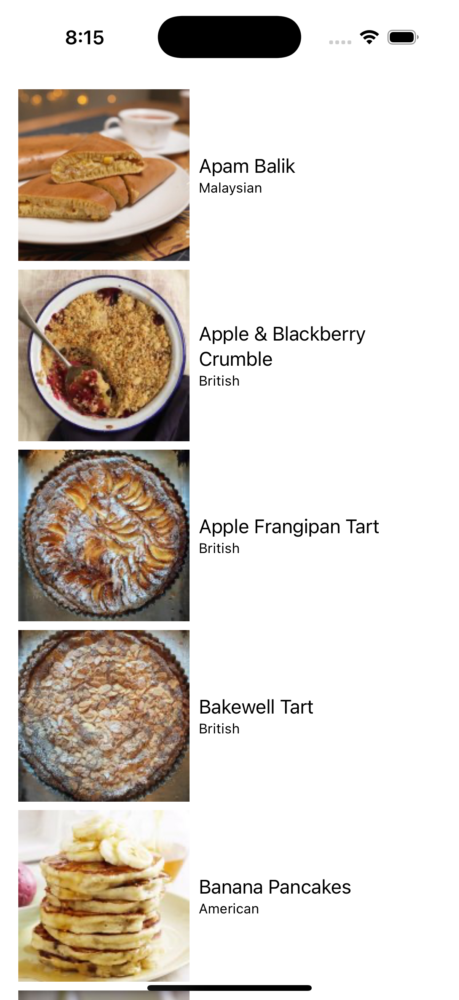

### Summary

This is a recipes app built as a part of Fetch's interview process.

The recipes list view displays an image of the product of the recipe as well its name and origin.

Selecting a recipe brings up a larger image of the food as well as links to the original recipe and a YouTube video, if available.

### Focus Areas

Focus was given to the detail view of the individual recipe. There were several possible implementations and I tried to decide on the simplest.

### Time Spent: Approximately how long did you spend working on this project? How did you allocate your time?

I spent about an hour and a half on the project.

### Trade-offs and Decisions: Did you make any significant trade-offs in your approach?

I put in a resizing method in the detail view that limits the sizing of the image to the width of the view. It didn't seem helpful to me to have the image appear larger than that.

### Weakest Part of the Project: What do you think is the weakest part of your project?

I could have incorporated a playback view of the YouTube video, but I would have had to copy a UIKIt solution and I didn't want to do that.

### Additional Information: Is there anything else we should know? Feel free to share any insights or constraints you encountered.
